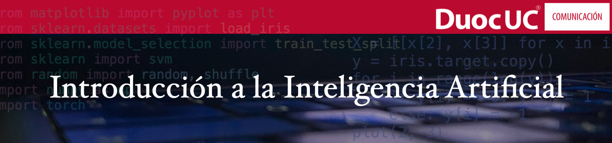

<p align="center">
  <a href="https://duoc.cl">
    
  </a>

  <!-- <h3 align="center">Logo</h3> -->

  <p align="center">
    Este repositorio contiene los archivos y herramientas para ejecutar un entorno de desarrollo para python. Los estudiantes de éste curso pueden instalar esta configuración base en su computador y trabajar con Visual Studio Code
    <br>
    <!-- <a href="https://reponame/issues/new?template=bug.md">Report bug</a>
    ·
    <a href="https://reponame/issues/new?template=feature.md&labels=feature">Request feature</a> -->
  </p>
</p>


## Tabla de contenidos

- [Tabla de contenidos](#tabla-de-contenidos)
- [Prerequisitos](#Prerequisitos)
- [Python](#python)
- [Contenido](#contenido)
- [Librerías](#librerías)
- [Creación y mantención](#creación-y-mantención)
- [Agradecimientos](#agradecimientos)
<!-- - [Copyright and license](#copyright-and-license) -->


## Prerequisitos

- La implementación utiliza Docker lo que permite generar un entorno de desarrollo aislado del computador anfitrión. El contenedor generado utiliza como base linux y sobre él se instalan las aplicaciones y librerías necesarias para ejecutar los ejemplos en lenguaje Python que se utilizan en el curso.
- Usted debe tener instalado previamente las siguientes aplicaciones gratuitas:

| Aplicación          | Vínculo de descarga                                                        |
|---------------------|----------------------------------------------------------------------------|
| docker-desktop      | [https://www.docker.com](https://www.docker.com/products/docker-desktop/ ) |
| visual studio code  | [https://code.visualstudio.com](https://code.visualstudio.com/download)    |
| LM Studio           | [https://lmstudio.ai](https://lmstudio.ai)    |


Si se requiere instalar otras librerías se debe realizar desde la Terminal, por ejemplo si se desea instalar la libreria simplekml:

```text
pip install simplekml
```

PIP es el gestionador de paquetes y librerías para Python, se puede acceder a su pagina [www.pypi.org](https://pypi.org/project/pip/)

## Python

El entorno de desarrollo viene con Python 3.10 y el gestionador de paquetes PIP ya instalado.

## Contenido

La estructura base de este repositorio se muestra a continuación:

```text
base_ia_tools
└── .devcontainer
    ├── devcontainer.json
    ├── docker-compose.yml
    ├── Dockerfile
└── Herramientas/
    ├── 1_Ejecutar_Carpeta_en_Contenedor.ipynb
└── img 
    ├── [imagenes usadas algunos archivos .ipynb]
└── otras carpetas...
```
Uso: el archivo 1_Ejecutar_Carpeta_en_Contenedor.ipynb contiene las instrucciones iniciales para ejecutar el contenedor.


## Librerías

El entorno de programación viene con 162 librerías pre instaladas.

Algunas de las librerías son las siguientes:

```text

- ipykernel
- numpy
- pandas
- matplotlib
- torch 
- torchvision 
- torchaudio 
- openai
- scikit-learn
- tqdm
- nbconvert

```

Para ver el total de librerias ejecute el siguiente comando en el Terminal:

```text
pip list
```


## Creación y mantención

**Ricardo Saldías F.**

email
- ri.saldias@profesor.duoc.cl
  
github
- <https://github.com/rsaldias>
- <https://github.com/ricardosaldias>

## Agradecimientos

Este curso ha sido posible gracias al apoyo de; Matias Bosshardt (director de la escuela de comunicación de DuocUC), Claudio Palacios (subdirector de la escuela de comunicación de DuocUC), Mauricio Benavente (docente DuocUC) y a los equipos del centro de formación docente y desarrollo curricular, Gracias a Tod@s!


<p align="center">
  <a href="https://duoc.cl">
    
  </a>

  <!-- <h3 align="center">Logo</h3> -->

  <p align="center">
    @2024
    <br>
    <!-- <a href="https://reponame/issues/new?template=bug.md">Report bug</a>
    ·
    <a href="https://reponame/issues/new?template=feature.md&labels=feature">Request feature</a> -->
  </p>
</p>


